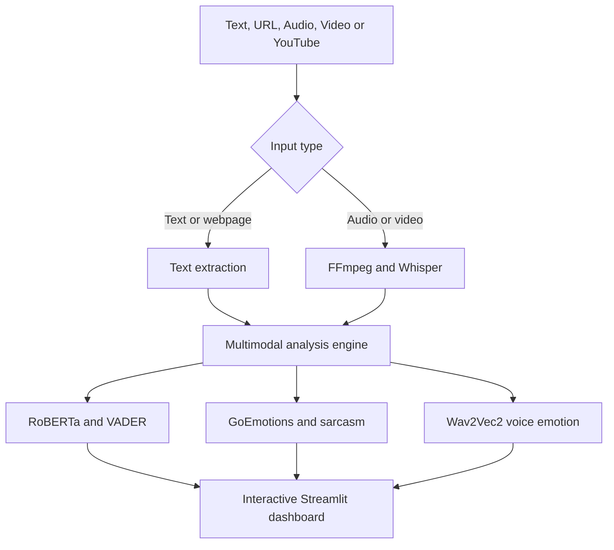

# 🧠 EmotiFusion AI

### Multimodal Sentiment, Emotion, Sarcasm & Voice Intelligence

<p align="center">
  
  
  
  
</p>

<p align="center">
  <strong>One platform. Multiple signals. Deeper emotional understanding.</strong>
</p>

EmotiFusion AI is an interactive multimodal intelligence platform that analyzes not only **what** people say, but also **how** they say it. It combines transformer models, rule-based NLP, speech recognition, voice-emotion analysis, sarcasm detection, and aspect extraction to generate an explainable view of sentiment across text, webpages, audio, video, and YouTube content.

**Academic focus:** Natural Language Processing, sentiment analysis, emotion recognition, multimodal AI, explainable AI, and human-computer interaction.

---

## ✨ Why EmotiFusion AI?

Traditional sentiment tools usually return only **Positive**, **Negative**, or **Neutral**. EmotiFusion AI goes further by combining several complementary signals:

- **Semantic sentiment** from a RoBERTa transformer
- **Lexicon sentiment** from VADER
- **Fine-grained emotions** from a GoEmotions model
- **Sarcasm probability** from a dedicated irony classifier
- **Voice emotion** from Wav2Vec2
- **Aspect-level sentiment** using spaCy noun-phrase extraction
- **Speech transcription** using Whisper

The result is a **richer and more transparent** analysis than relying on a single model.

---

## 🚀 Core Features

| Capability | What it does |
|------------|--------------|
| 📝 **Text analysis** | Classifies text as positive, negative, or neutral and reports confidence. |
| 📊 **Hybrid scoring** | Combines normalized RoBERTa and VADER signals for a balanced sentiment score. |
| 😊 **Emotion recognition** | Detects fine-grained emotions such as joy, anger, sadness, admiration, fear, and approval. |
| 🎯 **Aspect-based sentiment** | Identifies important aspects such as camera, battery, or service and evaluates each one separately. |
| 🧐 **Sarcasm detection** | Flags possible irony when literal wording may not match the intended sentiment. |
| 🎤 **Voice input** | Records speech, creates a transcript, and analyzes the spoken message. |
| 🎵 **Audio analysis** | Transcribes uploaded audio and compares textual emotion with vocal tone. |
| 🎬 **Video analysis** | Extracts audio from video, transcribes it, and performs multimodal analysis. |
| 🔗 **YouTube analysis** | Retrieves supported YouTube audio, produces a transcript, and analyzes its emotional content. |
| 🌐 **Webpage analysis** | Extracts readable webpage text and analyzes its sentiment and emotions. |
| 🤖 **Sentiment-aware assistant** | Responds while considering the emotional tone of the user's message. |
| 📚 **Analysis history** | Stores session results and visualizes confidence trends during the active session. |

---

## 🧩 System Architecture



### Hybrid Sentiment Logic

The application normalizes the transformer and lexicon scores before combining them:

```
Hybrid score = 0.80 × RoBERTa score + 0.20 × VADER score
```

This design uses **RoBERTa** for contextual meaning and **VADER** for interpretable lexical polarity.

---

## 🤖 AI Model Stack

| Task | Model or Tool | Purpose |
|------|---------------|---------|
| Contextual sentiment | `cardiffnlp/twitter-roberta-base-sentiment-latest` | Positive, negative, neutral sentiment |
| Lexicon sentiment | VADER | Rule-based polarity and compound scores |
| Fine-grained emotion | `SamLowe/roberta-base-go_emotions` | Multi-label emotion distribution |
| Sarcasm / irony | `cardiffnlp/twitter-roberta-base-irony` | Potential irony detection |
| Speech-to-text | OpenAI Whisper | Audio and video transcription |
| Speech emotion | `superb/wav2vec2-base-superb-er` | Emotion estimation from vocal tone |
| Aspect extraction | `en_core_web_sm` (spaCy) | Noun chunks and linguistic analysis |
| Media processing | FFmpeg + pydub | Audio extraction and conversion |
| YouTube processing | yt-dlp | Metadata and supported media retrieval |
| User interface | Streamlit + Plotly | Interactive controls and visual reports |

---

## 📁 Project Structure

```
Sentiment-Analysis/
├── app.py                 # Streamlit interface, navigation and charts
├── analysis_logic.py      # Model loading and analysis functions
├── requirements.txt       # Python dependencies
├── icon.png               # Application icon
├── temp_files/            # Temporary media generated at runtime
├── LICENSE                # MIT license
└── README.md              # Project documentation
```

The interface and analysis logic are separated so that the project is easier to maintain, test, and extend.

---

## 🛠️ Requirements

### Recommended Environment

- **Python** 3.10 or newer
- **OS:** Windows 10/11, Linux, or macOS
- **RAM:** 8 GB minimum; 16 GB recommended for smoother model loading
- **Internet:** Required only on first run to download model weights
- **FFmpeg:** Required for audio, video, and YouTube processing
- **Microphone:** Only if live voice recording is needed

CPU execution is supported. A compatible GPU can make transcription and transformer inference faster but is not mandatory.

---

## ⚡ Quick Start — Windows PowerShell

### 1. Clone the repository

```powershell
git clone https://github.com/Dhy4n-117/Sentiment-Analysis.git
cd Sentiment-Analysis
```

> If you are using your own fork, replace the URL with your repository URL.

### 2. Create and activate a virtual environment

```powershell
py -m venv venv
.\venv\Scripts\Activate.ps1
```

If PowerShell blocks activation, allow it for the current terminal only:

```powershell
Set-ExecutionPolicy -Scope Process -ExecutionPolicy Bypass
.\venv\Scripts\Activate.ps1
```

### 3. Install Python dependencies

```powershell
python -m pip install --upgrade pip setuptools wheel
python -m pip install -r requirements.txt
```

### 4. Download the spaCy English model

```powershell
python -m spacy download en_core_web_sm
```

### 5. Install and verify FFmpeg

Download FFmpeg from the [official FFmpeg download page](https://ffmpeg.org/download.html), extract it, and add its `bin` directory to your Windows PATH.

Verify the installation:

```powershell
ffmpeg -version
```

### 6. Run the application

```powershell
python -m streamlit run app.py
```

Open the local address shown in the terminal, normally:

```
http://localhost:8501
```

Stop the server with `Ctrl + C`.

---

## 🐧 Linux Setup

```bash
git clone https://github.com/Dhy4n-117/Sentiment-Analysis.git
cd Sentiment-Analysis

sudo apt update
sudo apt install -y ffmpeg portaudio19-dev python3-venv

python3 -m venv venv
source venv/bin/activate
python -m pip install --upgrade pip setuptools wheel
python -m pip install -r requirements.txt
python -m spacy download en_core_web_sm
python -m streamlit run app.py
```

---

## 🍎 macOS Setup

```bash
brew install ffmpeg portaudio

git clone https://github.com/Dhy4n-117/Sentiment-Analysis.git
cd Sentiment-Analysis

python3 -m venv venv
source venv/bin/activate
python -m pip install --upgrade pip setuptools wheel
python -m pip install -r requirements.txt
python -m spacy download en_core_web_sm
python -m streamlit run app.py
```

---

## 🔑 Optional Hugging Face Authentication

The public models can normally be downloaded without authentication. A free Hugging Face token can provide better rate limits.

```bash
python -m pip install --upgrade huggingface_hub
hf auth login
```

Create a **read-only** token from [Hugging Face settings](https://huggingface.co/settings/tokens). Never commit tokens, passwords, or API keys to GitHub.

---

## 🧪 How to Use the Platform

### Text Analysis

1. Select **Analyzer** from the sidebar.
2. Open the **Text** tab.
3. Enter a sentence, review, comment, or paragraph.
4. Select **Analyze Text**.
5. Review sentiment, confidence, emotion distribution, sarcasm score, and detected aspects.

**Example:**

> The battery life is excellent, but the camera quality is disappointing.

**Possible interpretation:**

- Overall sentiment: Mixed or Neutral
- Aspect: **battery life** → Positive
- Aspect: **camera quality** → Negative
- Emotions: approval and disappointment

### Audio or Video Analysis

1. Open **File Analysis**.
2. Upload a supported audio or video file.
3. Wait while the application extracts and transcribes the audio.
4. Compare the emotion in the **words** with the emotion detected from **vocal tone**.

### YouTube Analysis

1. Open **File Analysis → YouTube URL**.
2. Paste a supported public YouTube URL.
3. Select the preferred audio format.
4. Start the analysis.
5. Review or download the transcript and inspect the emotional analysis.

> Only process media that you have permission to access and use. Availability may depend on the source website and its terms.

---

## ✅ Installation Check

Run these commands after setup:

```bash
python -c "import streamlit, torch, transformers, cv2, spacy; print('Core imports: OK')"
python -c "import spacy; spacy.load('en_core_web_sm'); print('spaCy model: OK')"
ffmpeg -version
```

Then start the application:

```bash
python -m streamlit run app.py
```

---

## 🧯 Troubleshooting

| Problem | Solution |
|---------|----------|
| `ModuleNotFoundError: No module named 'cv2'` | Run `python -m pip install opencv-python`. |
| `ModuleNotFoundError: No module named 'pyaudio'` | Run `python -m pip install PyAudio`. On some Windows systems, Microsoft C++ Build Tools may be required. |
| `ffmpeg is not recognized` | Add the extracted FFmpeg `bin` directory to PATH, reopen PowerShell, and run `ffmpeg -version`. |
| spaCy model not found | Run `python -m spacy download en_core_web_sm`. |
| Hugging Face unauthenticated warning | It can be ignored for public models, or run `hf auth login`. |
| Model loading appears several times | The application loads separate models for sentiment, emotion, irony, transcription, and voice emotion. Wait for the first startup to finish. |
| `WinError 10054` appears once | Reopen the local page and rerun the app. Check VPN, proxy, firewall, and internet stability if it repeats. |
| Both `(venv)` and `(base)` appear | Deactivate Conda base, reactivate only `venv`, and run the app with `python -m streamlit run app.py`. |
| PowerShell reports an invalid escape warning in `app.py` | Do not place `.\venv\Scripts\Activate.ps1` directly in Python code; place it in a raw string such as `r".\venv\Scripts\Activate.ps1"`. |

Check that packages are installed in the active environment:

```bash
python -c "import sys; print(sys.executable)"
python -m pip check
```

The executable should point to the project's `venv` directory.

---

## ⚠️ Limitations

- The models **estimate** emotion; they do not directly observe a person's internal state.
- Accuracy can decrease for sarcasm, slang, code-mixed language, indirect speech, or domain-specific vocabulary.
- The current pipeline is primarily optimized for **English**.
- Long inputs may be shortened or processed within model context limits.
- Speech results depend on recording quality, background noise, accent, and microphone quality.
- CPU-only systems may take longer to load models and process media.
- YouTube and webpage features depend on network availability and source-site access rules.
- Session history may be lost after restarting the application unless persistent storage is added.

---

## 🛡️ Responsible AI and Privacy

EmotiFusion AI is intended for **learning, research, exploratory analytics, and decision support**.

- Do **not** use emotion predictions as the sole basis for hiring, grading, healthcare, policing, or other high-impact decisions.
- Obtain **consent** before analyzing private conversations, meetings, voice recordings, or videos.
- Avoid storing sensitive transcripts or recordings unnecessarily.
- Treat **model confidence** as uncertainty information, not proof that a prediction is correct.
- Review predictions manually when **context, culture, humour, or sarcasm** may change the meaning.

---

## 🗺️ Roadmap

- [ ] Speaker diarization for multi-person meetings
- [ ] Meeting-level emotion and engagement timeline
- [ ] Multilingual and code-mixed language support
- [ ] Long-document chunking and score aggregation
- [ ] Export reports as PDF and CSV
- [ ] Persistent database-backed analysis history
- [ ] Model evaluation dashboard with accuracy, F1-score, latency, and memory use
- [ ] Docker deployment
- [ ] REST API for external applications
- [ ] Human review workflow for uncertain predictions

---

## 🎓 Academic Value

This project demonstrates:

- Transformer-based NLP
- Lexicon-based sentiment analysis
- Multimodal feature fusion
- Automatic speech recognition
- Speech emotion recognition
- Aspect-based sentiment analysis
- Explainable and uncertainty-aware output
- Interactive AI application development with Streamlit

It can be extended into research on **online-meeting emotion recognition**, **customer-feedback intelligence**, **social-media monitoring**, or **lightweight emotion-model distillation**.

---

## 🤝 Contributing

Contributions are welcome.

1. Fork the repository.
2. Create a feature branch:

   ```bash
   git checkout -b feature/your-feature-name
   ```

3. Commit your changes:

   ```bash
   git commit -m "Add: your feature description"
   ```

4. Push the branch and open a pull request.

Please keep changes focused, document new dependencies, and test **text and media workflows** before submitting.

---

## 👨‍🎓 Maintainer

**Harsh Mhatre**
M.Sc. Data Analytics

---

## 🙏 Acknowledgements and Attribution

This academic version builds on the open-source [Dhy4n-117/Sentiment-Analysis](https://github.com/Dhy4n-117/Sentiment-Analysis) project and its MIT-licensed foundation.

It also uses open-source work from:

- [Hugging Face Transformers](https://github.com/huggingface/transformers)
- [CardiffNLP](https://huggingface.co/cardiffnlp)
- [GoEmotions](https://github.com/google-research/google-research/tree/master/goemotions)
- [OpenAI Whisper](https://github.com/openai/whisper)
- [spaCy](https://spacy.io/)
- [VADER Sentiment](https://github.com/cjhutto/vaderSentiment)
- [Streamlit](https://streamlit.io/)
- [FFmpeg](https://ffmpeg.org/)
- [yt-dlp](https://github.com/yt-dlp/yt-dlp)

When publishing a fork or derivative version, preserve the original license and attribution notices.

---

## 📄 License

This project is distributed under the **MIT License**. You may use, modify, and distribute it subject to the license terms and required attribution.

---

<p align="center">
  <strong>Built for meaningful, explainable, and responsible emotion-aware AI.</strong>
</p>